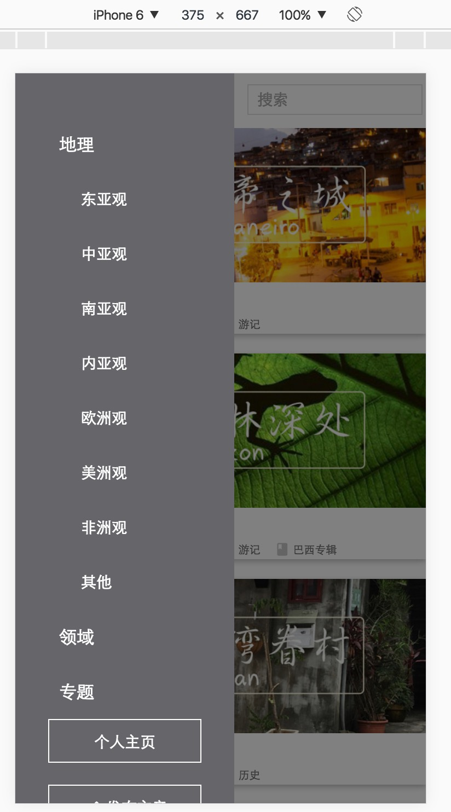
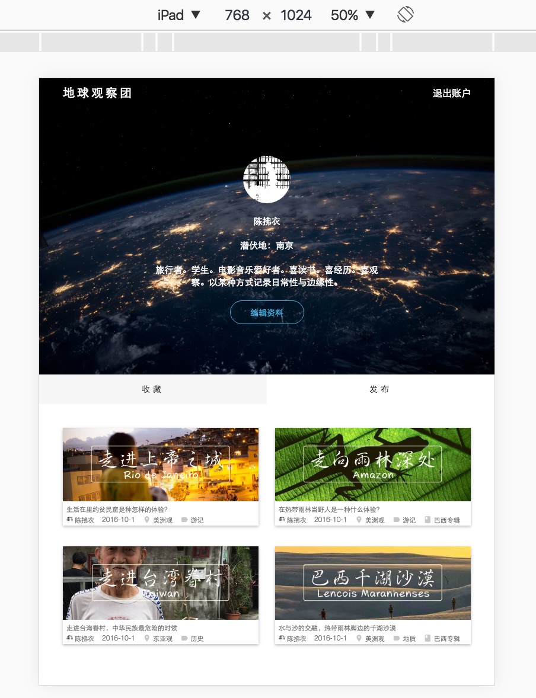
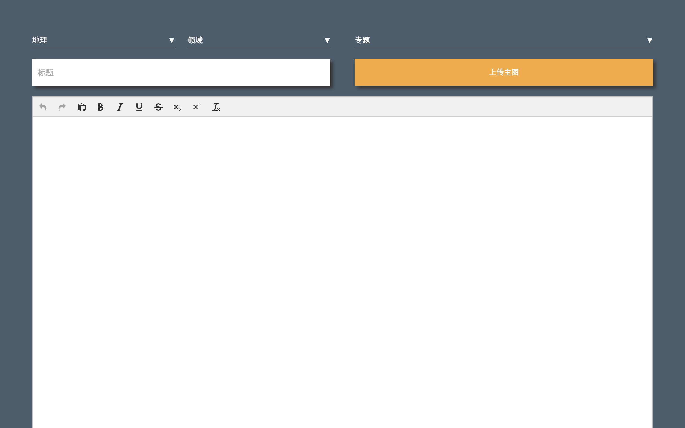
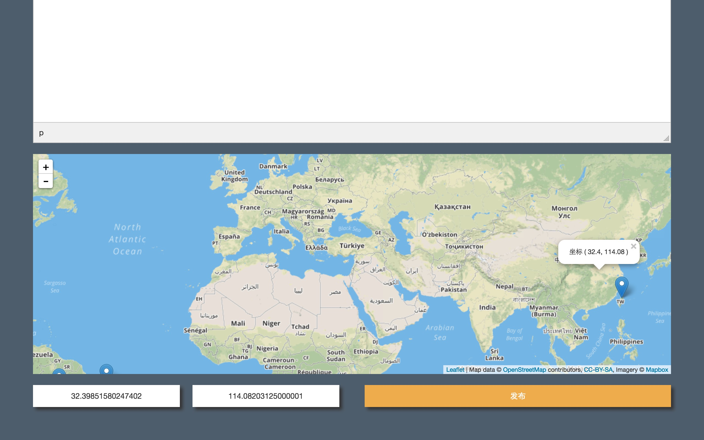

#Readme.md

运行：

````
$ git clone https://github.com/IreneZhou/Blog.git
$ cd Blog
$ virtualenv venv
$ source venv/bin/activate
$ pip install -r requirements.txt
$ python manage.py runserver
````

Use python3

预览：  

 

 

 

 