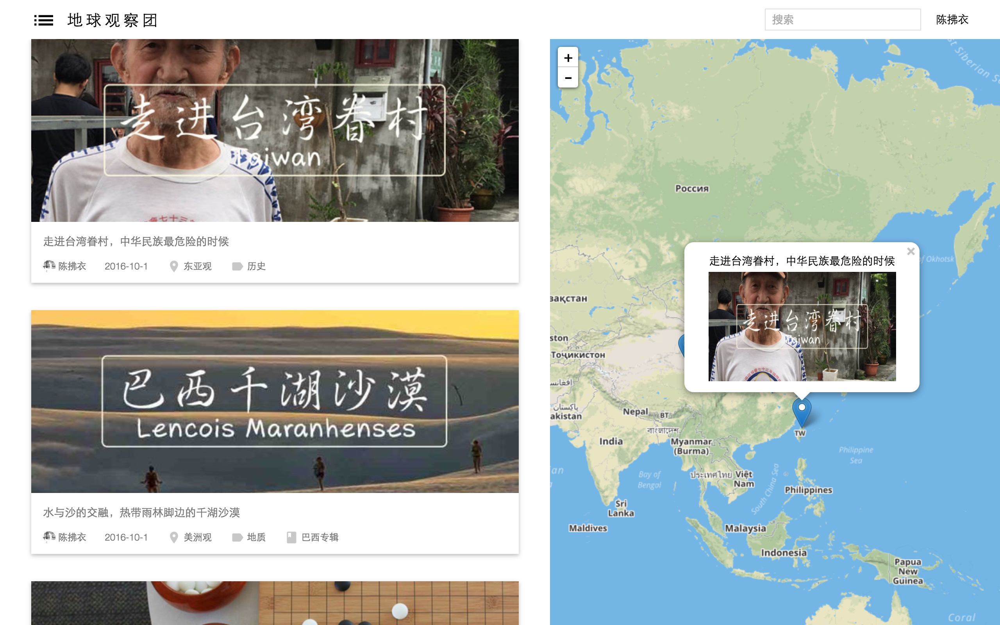
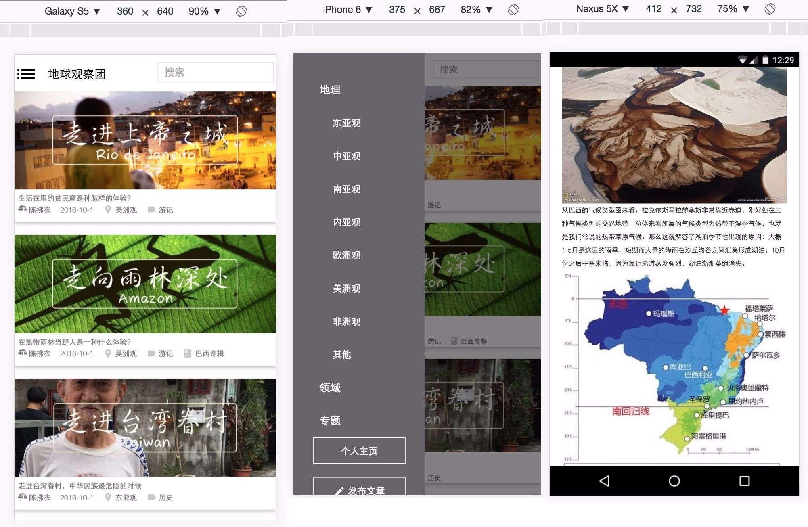
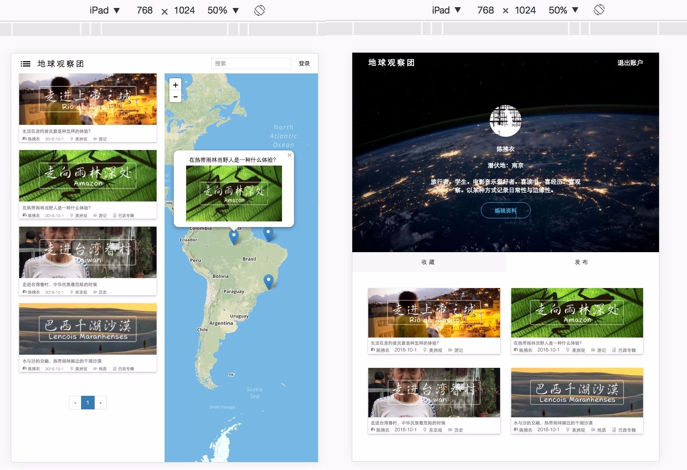
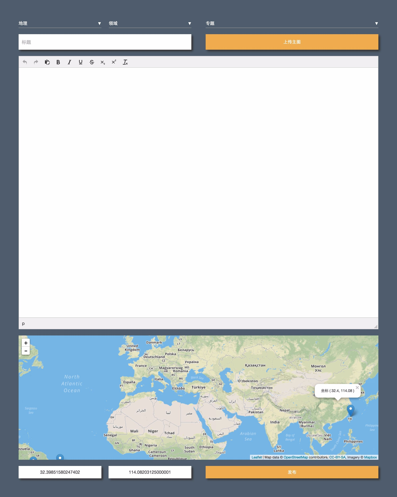

#Readme.md

#### Run：

````bash
$ git clone https://github.com/IreneZhou/Blog.git
$ cd Blog
$ virtualenv venv
$ source venv/bin/activate
$ pip install -r requirements.txt
$ python3 manage.py runserver
````


#### Backend:

-   Framework: Python Flask
-   Database: [SQLAlchemy](http://www.sqlalchemy.org/)
-   Python version: 3.4

#### Frontend:

-   HTML/CSS/jQuery
-   Bootstrap
-   [Material icons - Google Design](https://material.io/icons/)
-   [materializecss](materializecss.com)

#### Plugins:
-   [Leaflet](http://leafletjs.com/)  v1.0.3
-   [TinyMCE](https://www.tinymce.com/)  v4.5.4


#### Preview：  

 

 